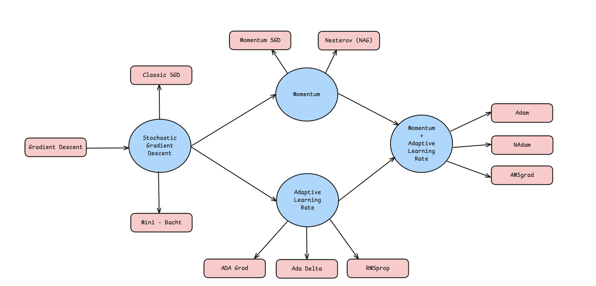

# Exploring Optimization Algorithms in Neural Network

This project delves into the world of neural network optimization, exploring various algorithms, their mathematical characteristics, and the impact of different optimization techniques on performance, convergence, and interpretability. By understanding these methods, we aim to improve model accuracy and training efficiency, advancing the use of neural networks in complex tasks.

## 🌍 Context
Neural networks have become a foundational tool in artificial intelligence, with applications ranging from image recognition to natural language processing. However, training these networks effectively is a challenge due to their complexity, the large volume of data required, and the tendency for models to become computationally expensive. Optimization techniques are essential for refining the training process, ensuring that models not only converge on accurate predictions but do so efficiently. This project addresses these needs by examining optimization algorithms, each offering unique benefits in terms of convergence speed, stability, and adaptability.

## 🎯 Objectives
Our goal is to explore and analyze optimization algorithms for neural networks, focusing on:
- **Algorithm Characteristics**: Understanding different optimization methods and their unique advantages.
- **Mathematical Interpretation**: Detailed explanations of forward and backward propagation, highlighting the use of the chain rule in backpropagation.
- **Performance Analysis**: Examining each algorithm's effectiveness, convergence rate, and suitability for various neural network architectures.

## 📁 Dataset Used
We utilize the **YearPredictionMSD** dataset from the UCI Machine Learning Repository, consisting of 515,345 samples and 90 features per sample. This dataset, derived from audio characteristics of songs, serves as a complex regression problem, ideal for testing and analyzing the effectiveness of various optimization methods on neural network training.

### Dataset Details
- **Features**: Audio characteristics such as timbre, chroma, and spectral contrast.
- **Target**: Year of song release (regression task).
- **Use Case**: Predicting a continuous target variable based on complex, high-dimensional audio data.

## 🧠 Project Sections

### 1. Neuron Creation from Scratch
   - **Goal**: Construct individual neurons as the fundamental unit of a neural network.
   - **Explanation**: Detailed mathematical breakdown of neuron functioning, including activation functions and their role in capturing nonlinear patterns.
   
### 2. Layer Construction
   - **Goal**: Build and stack multiple neurons to form network layers.
   - **Explanation**: Mathematical insights into how layers transform data through weights and biases, preparing it for deeper, more abstract processing.

### 3. Neural Network Architecture
   - **Goal**: Combine layers into a complete neural network, capable of handling complex input data.
   - **Explanation**: Discussion on forward propagation, layer-by-layer data transformation, and introduction to loss functions.

### 4. Mathematical Interpretations
   - **Forward Propagation**: Step-by-step explanation of how data flows through the network, including the transformations applied at each layer.
   - **Backward Propagation**: Mathematical breakdown of the backpropagation algorithm, focusing on the chain rule and the role it plays in gradient calculation for weight updates.

## 🔄 Basic Optimization Algorithms

### Gradient Descent: The Foundation
   - **Concept**: Explains the fundamentals of gradient descent as the core optimization method for neural networks.
   - **Mathematical Background**: Formulae for calculating gradients and updating weights.
   - **Performance**: Discussion on limitations and challenges, such as slow convergence and potential for getting stuck in local minima.

### Stochastic Gradient Descent (SGD)
   - **Improvement**: Utilizes random mini-batches rather than the full dataset, improving computational efficiency.
   - **Performance Benefits**: Faster convergence in larger datasets, though it introduces variability in each update step.

## 📈 Advanced Performance-Enhancing Algorithms

### Momentum-Based Techniques
1. **SGD with Momentum**: Adds velocity to weight updates, helping to overcome local minima and ensuring smoother convergence.
2. **Nesterov Accelerated Gradient (NAG)**: An anticipative method that adjusts direction before calculating the gradient, leading to more efficient and often faster convergence.
   - **Mathematical Explanation**: Overview of momentum terms and their effect on weight updates.
   - **Conceptual Benefits**: Explanation of how momentum techniques speed up convergence in deep, narrow loss surfaces.

### Adaptive Learning Rate Methods
1. **AdaGrad**: Adjusts the learning rate based on past gradients, benefiting sparse data but potentially leading to overly small rates.
2. **AdaDelta and RMSprop**: Builds on AdaGrad by maintaining moving averages of squared gradients, providing better long-term performance.
   - **Mathematical Explanation**: Detailed formulae and rationale for adaptive adjustments.
   - **Usage Context**: Description of when and why adaptive rates are beneficial, particularly in sparse or nonstationary environments.

### Combination of Momentum and Adaptive Methods
1. **Adam**: Combines momentum with adaptive learning rates, offering robust performance across various neural network architectures.
2. **Nadam**: Extends Adam by incorporating Nesterov momentum, resulting in faster convergence in some scenarios.
3. **AMSGrad**: A variant of Adam that maintains a stricter adaptation of learning rates, designed to improve stability.
   - **Mathematical Details**: Step-by-step breakdown of the Adam and Nadam updates, including the momentum and adaptive components.
   - **Performance Insights**: Analysis of these methods' stability and accuracy in different scenarios.

## 📊 Comparison of Optimization Methods
| Optimization Method | Characteristics                  | Pros                                         | Cons                                      |
|---------------------|---------------------------------|----------------------------------------------|-------------------------------------------|
| Gradient Descent    | Full-batch, no adaptation       | Reliable for small datasets                  | Slow on large datasets                    |
| SGD                 | Mini-batch, stochastic updates  | Faster, more scalable                        | Higher variability, slower convergence    |
| SGD + Momentum      | Adds velocity term              | Smooths updates, avoids local minima         | Sensitive to parameter tuning             |
| Nesterov            | Anticipates updates             | Accelerated convergence                      | Complex implementation                    |
| AdaGrad             | Adaptive rate based on history  | Effective for sparse data                    | Rate decay can be too aggressive          |
| RMSprop             | Adapts rate without decay       | Maintains effective learning rate            | May require careful tuning                |
| Adam                | Momentum + adaptive rate        | Robust across architectures                  | Potential instability in certain cases    |
| Nadam               | Adam + Nesterov momentum        | Faster convergence                           | Complexity in hyperparameter adjustment   |

## 📉 Figure

## Additional Sections
### Practical Applications
- Discussion on the practical implications of choosing one optimization method over another for different types of neural networks and datasets.

### Limitations and Challenges
- Coverage of known issues, such as vanishing/exploding gradients and the impact of learning rate schedules.

### Future Work
- Suggestions for potential improvements in optimization, such as integrating second-order methods or hybrid approaches.

## Conclusion
This project demonstrates the impact of different optimization techniques on neural network training, providing a deeper understanding of each method's strengths, limitations, and applications.

---

This README offers an in-depth guide to neural network optimization techniques, covering both fundamental and advanced approaches.
